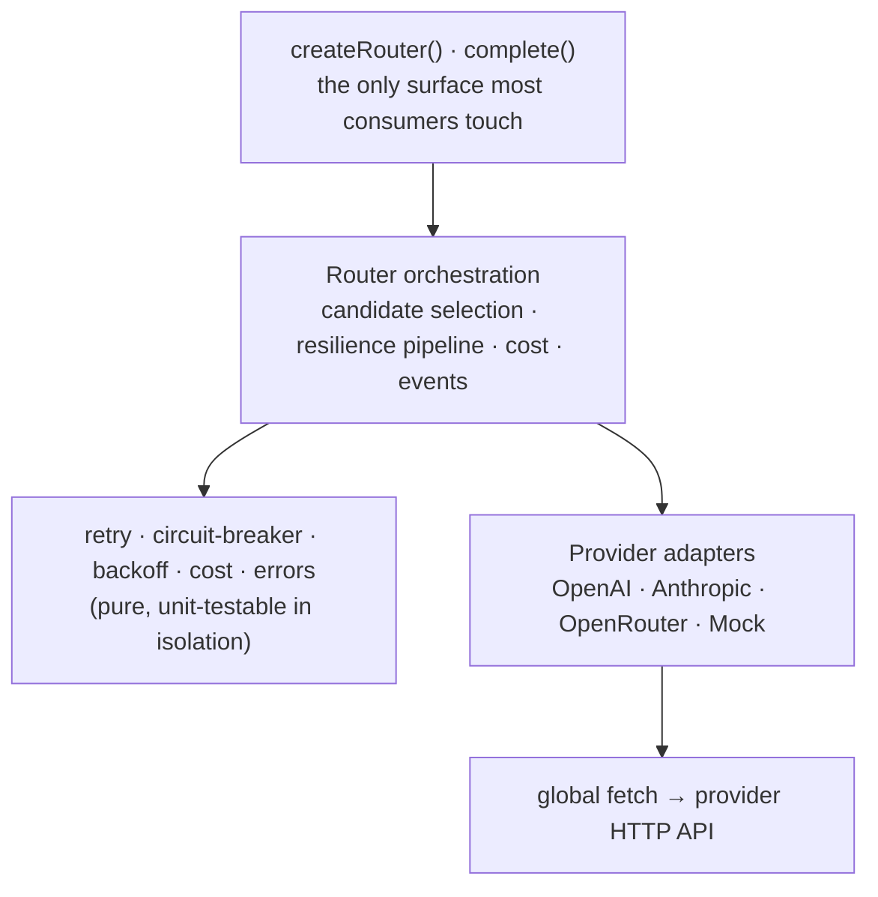

# Architecture

How llm-router is structured, how a request flows through the resilience
pipeline, and the reasoning behind the decisions.

## Layered design

Dependencies point one direction. Adapters know nothing about retries, fallback,
or breakers; the resilience helpers know nothing about any provider's wire
format; the router wires them together. That separation is why providers are
swappable and the resilience logic is provider-agnostic and testable.

## Request lifecycle

`complete()` runs this for one request:

1. **Build the candidate chain** — the requested or configured provider order,
   de-duped (each provider visited at most once), filtered to providers that
   support the model.
2. **For each candidate**, gated by its circuit breaker:
   - **Breaker open?** Fast-skip it (no network call) and fall over.
   - **Retry loop** (up to `maxAttemptsPerProvider`): call the adapter under a
     per-attempt timeout. On a **retryable** error (429, 5xx, network, timeout,
     malformed) wait `max(Retry-After, backoff-with-jitter)` and retry — unless
     the overall deadline can't fit the wait. **Non-retryable** errors leave the
     loop immediately.
3. **Advance or surface.** A provider fault (or exhausted retries) **fails over**
   to the next candidate. `content_filter` and `bad_request` are futile
   elsewhere, so they **surface immediately**.
4. **Exhausted chain** → one `AllProvidersFailed` carrying every provider's last
   error and the **most actionable** top-level code (auth > context-length >
   content-filter > rate-limit > deadline > …).
5. **Success** → the result is tagged with the serving provider, token `usage`,
   estimated `costUsd`, and a full `attempts` audit trail.

## Resilience decisions (and the failure classes behind them)

Every error is normalized to a `RouterError` with three derived properties:

- **`retryable`** — `rate_limit`, `server`, `network`, `timeout`, `malformed`.
  Everything else short-circuits the retry loop.
- **`providerFault`** — counts toward the circuit breaker (`server`, `network`,
  `timeout`, `malformed`, `auth`). A `bad_request` or `context_length` is the
  _caller's_ fault, so it never penalizes a healthy provider.
- **`failover`** — true for everything except `content_filter` and `bad_request`
  (retrying those on another provider is pointless).

**Backoff** is exponential with **full jitter** — `random(0, min(base·2ⁿ, cap))`
— to avoid synchronized retry storms across many callers. A provider's
`Retry-After` always wins over computed backoff, and a wait is never taken if it
would overshoot the deadline.

**Circuit breaker** is per-provider with three states. It trips OPEN after a
failure threshold within a rolling window (or immediately on a hard-down auth
error), fast-skips while open, then allows a single HALF-OPEN probe after a
cooldown — one success closes it, one failure re-opens it. A dead provider is
detected and skipped without burning a request slot.

**Two independent timers.** A **per-attempt timeout** bounds a single call
(clamped so it can never exceed the remaining budget); the **overall deadline**
bounds the entire operation across all retries and failovers and is _terminal_ —
when it fires, nothing else is attempted and `DeadlineExceeded` is surfaced.

## How the design was hardened

The resilience semantics were specified up front, then **adversarially audited**
for the failure modes that break naive gateways: retry storms, cyclic or
infinite fallback, double-charging across retries+failovers, circuit-breaker
races, and the overall deadline not being honored once retries and failovers
stack. The fixes are baked in — a finite visited-set chain, deadline-gated
retries, breaker faults separated from request faults — and locked down by the
mock-provider test matrix.

## Why zero runtime dependencies

A library that sits in the request path of every AI call should add no
third-party attack surface and no version churn. The adapters use the global
`fetch`; the resilience layer is plain TypeScript. Nothing from npm ships at
runtime.

## Extending it

- **Add a provider:** implement the `LLMProvider` interface (`id`,
  `capabilities`, `complete`) — map your request/response and throw `RouterError`
  on failure. The router handles the rest.
- **Streaming:** the `LLMProvider` interface reserves an optional `stream()`;
  the streaming router (fail over only before the first chunk is emitted) is the
  designed next step.
