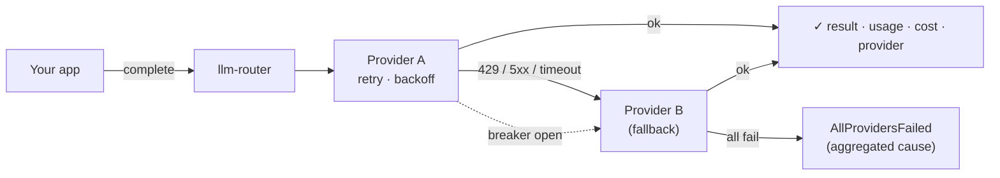

# llm-router

[](https://github.com/EricAgyemang478/llm-router/actions/workflows/ci.yml)
[](./LICENSE)
[](package.json)
[](.nvmrc)

A **resilient gateway in front of multiple LLM providers.** When one provider has
an outage, rate-limits you, or times out, the router automatically **fails over**
to the next — with retries, circuit breaking, deadlines, and **per-call cost
tracking** — so your app stays up and your spend stays visible. **Zero runtime
dependencies.**



## Quick start

```ts
import { createRouter, openai, anthropic, openRouter } from "llm-router";

const router = createRouter({
  providers: [
    openai({ apiKey: process.env.OPENAI_API_KEY }), // keys from env, never hardcoded
    anthropic({ apiKey: process.env.ANTHROPIC_API_KEY }),
    openRouter({ apiKey: process.env.OPENROUTER_API_KEY }), // model-agnostic last resort
  ],
  fallback: ["openai", "anthropic", "openrouter"],
  prices: { "gpt-4o-mini": { inputPerMTok: 0.15, outputPerMTok: 0.6 } },
  onEvent: (e) => console.debug(e), // optional telemetry hook
});

const res = await router.complete({
  messages: [{ role: "user", content: "Say hi." }],
  model: "gpt-4o-mini",
});

res.text; // "Hi!"
res.provider; // which provider actually served it (after any fallback)
res.usage; // { promptTokens, completionTokens, totalTokens }
res.costUsd; // estimated from the price table
res.attempts; // full audit trail of every provider tried
```

## What it handles

| Failure                          | Behavior                                                                          |
| -------------------------------- | --------------------------------------------------------------------------------- |
| **429 rate limit**               | retry on the same provider (honoring `Retry-After`), then fail over               |
| **5xx / network / timeout**      | retry with exponential backoff + jitter, then fail over                           |
| **401 / 403 auth**               | no retry — trip the breaker and fail over (alerts on a config problem)            |
| **content filter / bad request** | surface immediately — futile to retry elsewhere                                   |
| **a dead provider**              | circuit breaker fast-skips it (no wasted call) until a cooldown probe             |
| **everything down**              | one `AllProvidersFailed` with the per-provider cause and the most actionable code |

Two timers bound every call: a **per-attempt timeout** and a **terminal overall
deadline** that stops all retries/failovers once it fires.

## Providers

`openai`, `anthropic`, `openRouter` (real adapters over `fetch`, no SDKs), and
`mock` — a deterministic, key-free provider used to test every failure mode.
Adding one is implementing a single `LLMProvider` interface.

## Why it's trustworthy

The resilience semantics were designed and then **adversarially audited** for
retry storms, cyclic fallback, double-charging, and breaker races. The behavior
is locked down by tests: a **mock-provider failure-mode matrix** exercises happy
path, fallback, retry-then-succeed, non-retryable skip, breaker fast-skip,
deadline, and cost accounting — all without touching a real API.

Full design in **[ARCHITECTURE.md](./ARCHITECTURE.md)**.

## Scripts

```bash
npm test         # mock-provider failure-mode matrix + unit tests
npm run build    # compile to dist/ (with .d.ts types)
```

## License

[MIT](./LICENSE) © Eric Agyemang
